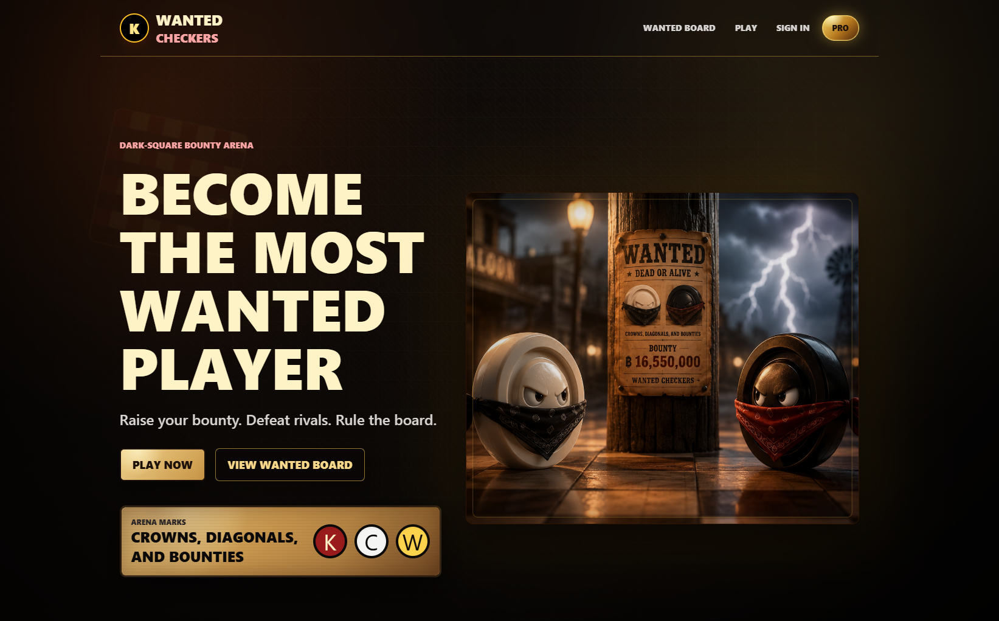
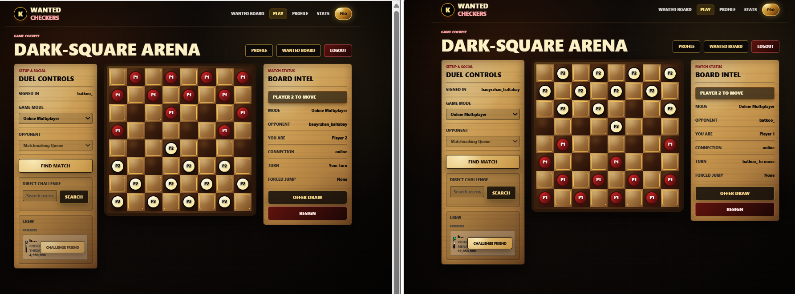
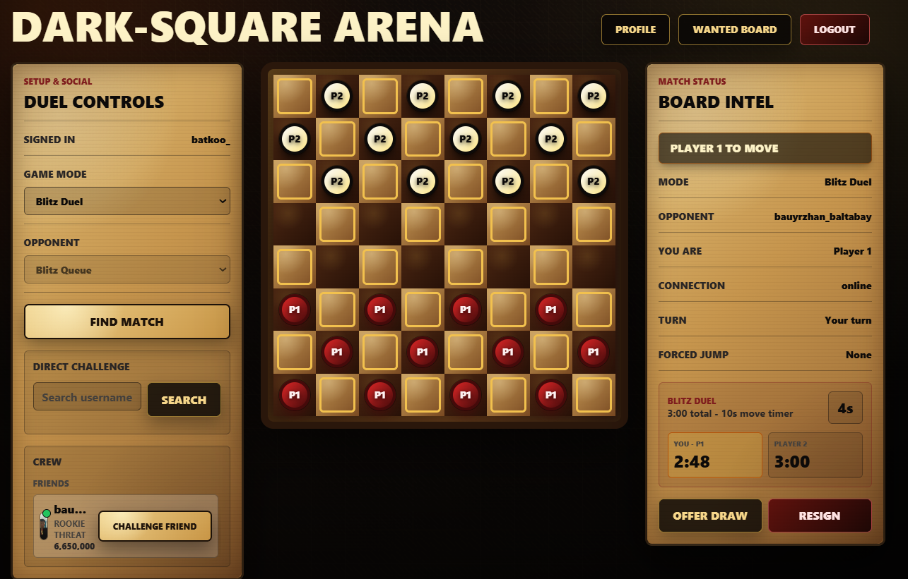
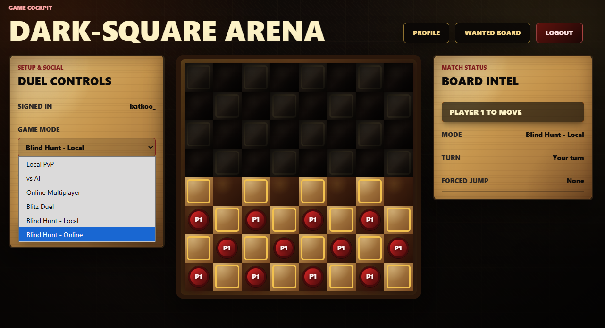
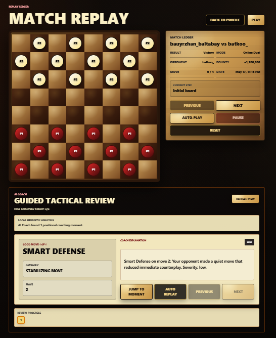
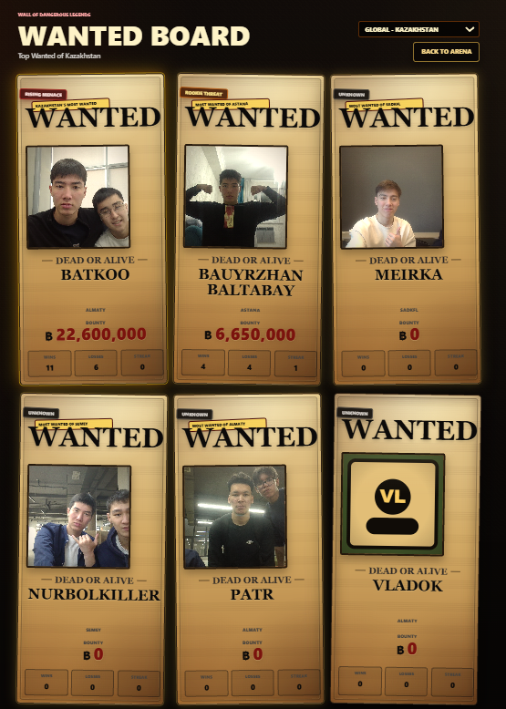
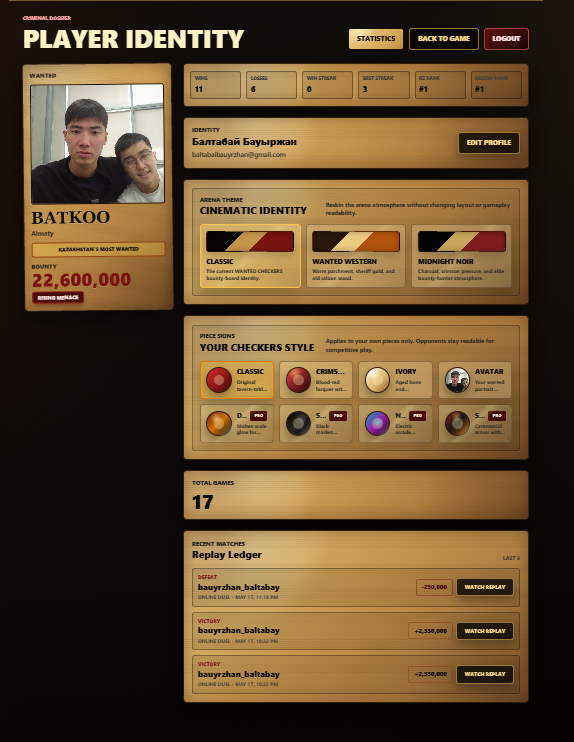
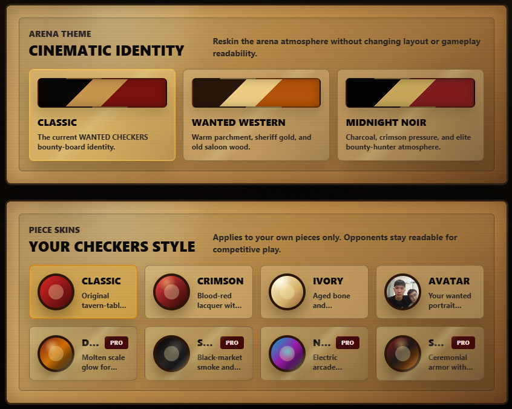

# WANTED CHECKERS

**A cinematic multiplayer checkers platform where every victory raises your bounty.**

WANTED CHECKERS transforms classic checkers into a competitive bounty arena with live multiplayer, AI coaching, replays, player profiles, regional leaderboards, and a dramatic WANTED-poster identity.

---

## Preview

> Screenshots will be added here.

## Landing Page

---

## Gameplay Board

---

## Blitz Duel

---

## Blind Hunt Mode

---

## AI Coach Replay

---

## WANTED Board

---

## Profile / Statistics

---

## Skins / PRO Preview

---

## Live Demo

- **Frontend:** [https://wanted-checkers-1pco.vercel.app](https://wanted-checkers-1pco.vercel.app)
- **Backend:** [https://wanted-checkers.onrender.com](https://wanted-checkers.onrender.com)
- **Repository:** `Add GitHub repository URL`

---

## About

WANTED CHECKERS is a full-stack game platform prototype built around one idea:

> What if checkers felt like a dangerous competitive arena where every player becomes a wanted legend?

Players can sign in with Google, play multiple game modes, challenge friends, build bounty, climb Kazakhstan regional leaderboards, review matches, and customize their visual identity.

It is designed as both a playable game and a startup-style product MVP.

---

## Why It Is Valuable

- **Replay learning:** players can review completed matches move by move.
- **Competitive progression:** bounty, tiers, streaks, and ranks create long-term goals.
- **Social multiplayer:** matchmaking, direct challenges, and friends make the platform feel alive.
- **Cinematic identity:** posters, themes, skins, sounds, and result overlays give the game a memorable brand.
- **Product thinking:** the project combines gameplay, retention, progression, and presentation in one coherent MVP.

---

## Features

### Core Gameplay

- Server-authoritative checkers engine
- Forced captures and multi-jump captures
- Russian-style flying kings
- Backward captures for regular pieces
- Win and draw detection
- Drag-and-drop pieces, animations, and sound effects

### Multiplayer

- Online matchmaking
- Real-time Socket.IO game sync
- Direct player challenges
- Friends list and friend requests
- Resign and draw offer flow
- Active online match protection

### Progression

- Google-only authentication
- Player profiles and avatars
- Bounty system
- WANTED Board leaderboard
- Kazakhstan regional rankings
- Player statistics dashboard

### Replay + AI Coach

- Match history
- Move-by-move replay viewer
- Guided AI Coach review flow
- Local tactical analysis
- Optional Grok-enhanced coaching explanations

### Visual Identity

- Cinematic WANTED-poster UI
- Match result overlays
- Theme system
- Piece skins
- Fake PRO presentation modal

---

## Game Modes

- **Local PvP:** two players on one board.
- **vs AI:** play against Beginner, Intermediate, or Expert backend AI.
- **Online Multiplayer:** live player-vs-player matches.
- **Blitz Duel:** fast online mode with 3-minute clocks and 10-second turns.
- **Blind Hunt:** fog-of-war checkers where players only see nearby squares.

---

## Tech Stack

**Frontend**

- Next.js 14
- React
- Tailwind CSS
- Socket.IO Client

**Backend**

- Node.js
- Express
- Socket.IO
- JWT authentication
- Google Identity Services

**Database + Deployment**

- PostgreSQL / Neon
- Render backend
- Vercel frontend

---

## Author

**Baltabai Bauyrzhan**

Built as a cinematic full-stack multiplayer game MVP with strong product identity, competitive systems, and modern web architecture.
